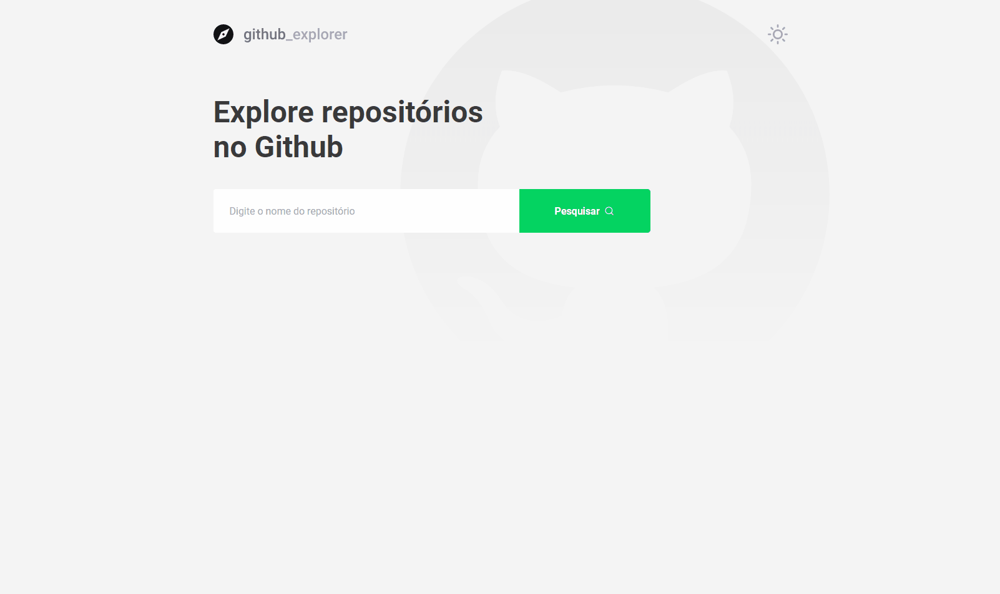

<div align="center">
  

<b>Liste seus repositórios favoritos do GitHub e veja as informações eproblemas de cada um deles!</b>

<!--  Shields -->
   

  

  
  <a href="https://github.com/filipebsmaia/GithubExplorer/commits/master">
    
  </a>

  <a href="https://github.com/filipebsmaia/GithubExplorer/issues">
    
  </a>

  
<!--  Shields -->
</div>
</br>
<div align="center">
  

</div>

<!-- Layout https://www.figma.com/file/9TlOcj6l7D05fZhU12xWT3/Ecoleta-(Booster)?node-id=0%3A1 -->

# Índice

- [Sobre](#sobre)
- [Tecnologias Utilizadas](#tecnologias)
- [Como Usar](#como-usar)
- [Como Contribuir](#como-contribuir)

<a id="sobre"></a>

## :bookmark: Sobre

<p>
O <strong>Github Explorer</strong> foi uma aplicação desenvolvida no bootcamp da rocketseat. O objetivo da aplicação listar repositorios do github e mostrar informações dos mesmos.
<p>
<p>
Foram feitos algums adicionais do projeto original como o tema escuro e as tags nas issues dos repositóros.
<p>

<a id="tecnologias"></a>

## :rocket: Tecnologias

O projeto foi desenvolvido utilizando as seguintes tecnologias:

- [TypeScript](https://www.typescriptlang.org/)
- [ReactJS](https://reactjs.org/)
- [React Router Dom](https://github.com/ReactTraining/react-router/tree/master/packages/react-router-dom)
- [Axios](https://github.com/axios/axios)
- [Styled Components](https://styled-components.com/)
- [Polished](https://polished.js.org/)
- [React Icons](https://react-icons.github.io/react-icons/)

<a id="como-usar"></a>

## :information_source: Como usar

- ### **Pré-requisitos**

Para clonar a aplicação você ira precisar do [Git](https://git-scm.com), [Node.js v12.16.3](https://nodejs.org/) ou maior + [Yarn v1.17.3](https://yarnpkg.com/) ou maior instalado em seu computador. Por linha de comando:

```sh
  # Clone o repósitorio
  $ git clone https://github.com/filipebsmaia/githubexplorer.git

  # Entre na pasta
  $ cd githubexplorer

  # Instale as dependencias
  $ yarn

  # Iniciando aplicação
  $ yarn start


```

<a id="como-contribuir"></a>

## :recycle: Como contribuir

- Faça um Fork desse repositório,
- Crie uma branch com a sua feature: `git checkout -b my-feature`
- Commit suas mudanças: `git commit -m 'feat: My new feature'`
- Push a sua branch: `git push origin my-feature`

---

<div align="center">
<h4>
    Feito com 💜 por <a href="https://www.linkedin.com/in/filipebsmaia/" target="_blank">Filipe Maia</a>
</h4>
</div>
